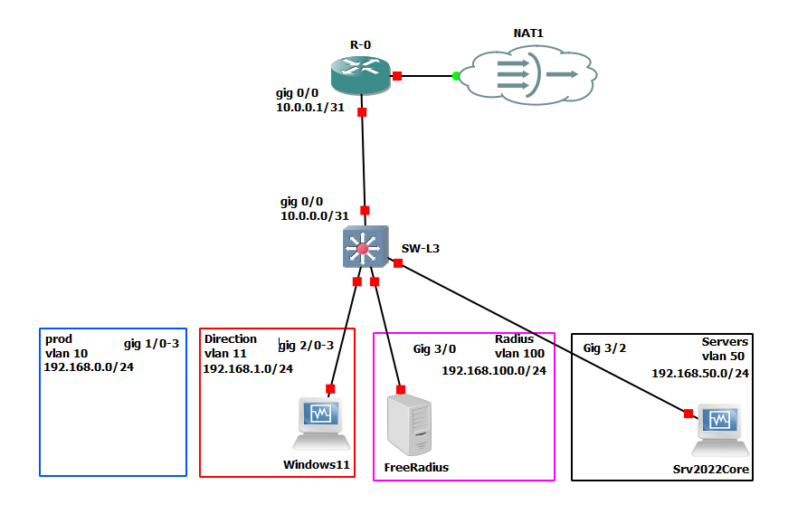

### Configuration d'un schéma réseau avec la mise en oeuvre de FreeRadius sur GNS3:


# I. Configuration du Switch 🖧
Se connecter à la console du switch puis aller en mode config :  
**Commandes Cisco :**

```bash
enable
configure terminal
```

Puis coller la running-config correspondant au switch de Niv.III.

---

# II. Configuration du Routeur 🌐
Se connecter à la console du routeur puis aller en mode config :  
**Commandes Cisco :**

```bash
enable
configure terminal
```

Puis coller la running-config correspondant au routeur R-0.

---

# III. Configuration du Serveur FreeRADIUS 💻
1. Connecter une machine Debian sur l'interface `gig 3/0` du switch `SW-L3`.
2. Attribuer l'adresse IP `192.168.100.250/24` et la passerelle `192.168.100.254` sur la machine Debian.
3. Télécharger et lancer le script suivant :  

**Commandes Bash :**

```bash
wget https://raw.githubusercontent.com/itform-fr/FreeRadius-GNS3/refs/heads/main/FreeRadius/config.sh
bash config.sh
```

---

# IV. Configuration du Serveur Windows Core 🖥️
1. Installer le serveur Windows.
2. Exécuter les commandes PowerShell suivantes :

**Commandes PowerShell :**

```powershell
$Carte=$(Get-NetAdapter).name
Set-NetIPInterface -InterfaceAlias $Carte -Dhcp Disabled
New-NetIPAddress -InterfaceAlias $Carte -IPAddress 192.168.50.250 -PrefixLength 24 -DefaultGateway 192.168.50.254
```

3. Télécharger et exécuter le script suivant :

```powershell
curl -o c:\deploy.ps1 https://raw.githubusercontent.com/itform-fr/FreeRadius-GNS3/refs/heads/main/SRV%202022%20Core/deploy.ps1
c:\deploy.ps1
```

4. Après le redémarrage du serveur, exécuter les commandes suivantes :

```powershell
curl -o c:\configure.ps1 https://raw.githubusercontent.com/itform-fr/FreeRadius-GNS3/refs/heads/main/SRV%202022%20Core/Configure.ps1
c:\configure.ps1
```

---

# V. Activation du Service 802.1X sur un Poste Windows 11 🔒
Exécuter les commandes suivantes pour activer le service 802.1X :

```powershell
Start-Service dot3svc
Set-Service dot3svc -StartupType Automatic
```
